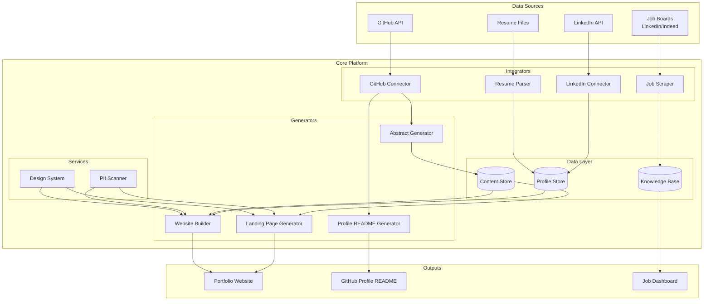
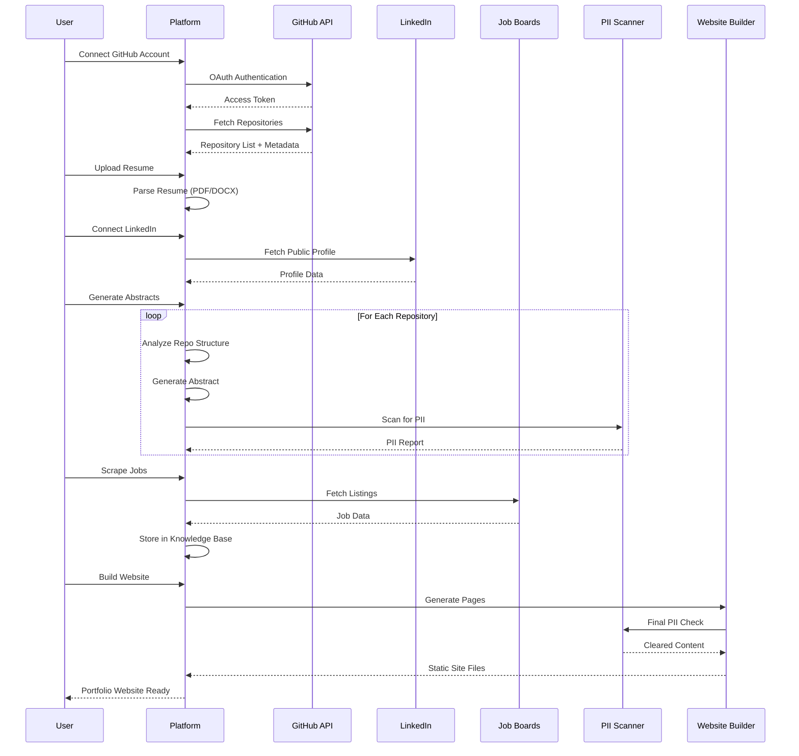

# Design Document: Career Showcase Platform

## Overview

The Career Showcase Platform is a multi-component system that enables professionals to create a polished online presence for job seeking in the AI/ML engineering space. The platform integrates with GitHub and LinkedIn APIs, scrapes job listings, generates project abstracts and landing pages, and produces a personal portfolio website with neo-brutalism design aesthetics.

The system is designed as a modular architecture with four primary components:
1. **Portfolio Generator** - GitHub integration and project showcase generation
2. **Job Scraper** - Multi-source job listing aggregation
3. **Website Builder** - Static site generation with neo-brutalism design
4. **Profile Integrator** - Resume parsing and LinkedIn data aggregation

## Architecture



### System Flow



## Components and Interfaces

### 1. GitHub Connector

Handles authentication and data retrieval from GitHub API.

```typescript
interface GitHubConnector {
  authenticate(token: string): Promise<AuthResult>;
  getRepositories(): Promise<Repository[]>;
  getRepositoryDetails(repoName: string): Promise<RepositoryDetails>;
  getReadmeContent(repoName: string): Promise<string | null>;
  getUserProfile(): Promise<GitHubProfile>;
}

interface Repository {
  name: string;
  description: string | null;
  isPrivate: boolean;
  languages: Record<string, number>;
  stars: number;
  forks: number;
  lastUpdated: Date;
  topics: string[];
  url: string;
}

interface RepositoryDetails extends Repository {
  readme: string | null;
  fileStructure: FileNode[];
  contributors: number;
  license: string | null;
}
```

### 2. Abstract Generator

Analyzes repositories and generates human-readable project summaries.

```typescript
interface AbstractGenerator {
  generateAbstract(repo: RepositoryDetails, options: AbstractOptions): Promise<ProjectAbstract>;
  regenerateSection(abstract: ProjectAbstract, section: string): Promise<ProjectAbstract>;
}

interface AbstractOptions {
  includeMetrics: boolean;
  maxLength: number;
  tone: 'professional' | 'casual';
  hideProprietaryDetails: boolean;
}

interface ProjectAbstract {
  id: string;
  repositoryName: string;
  title: string;
  summary: string;
  technologies: string[];
  keyFeatures: string[];
  impactMetrics: string[];
  isPublic: boolean;
  generatedAt: Date;
  lastEdited: Date | null;
}
```

### 3. Landing Page Generator

Creates individual project showcase pages.

```typescript
interface LandingPageGenerator {
  generatePage(abstract: ProjectAbstract, design: DesignConfig): Promise<LandingPage>;
  updatePage(pageId: string, updates: Partial<LandingPage>): Promise<LandingPage>;
}

interface LandingPage {
  id: string;
  projectId: string;
  slug: string;
  html: string;
  css: string;
  assets: Asset[];
  metadata: PageMetadata;
}

interface DesignConfig {
  colorScheme: ColorScheme;
  typography: TypographyConfig;
  layout: LayoutConfig;
}
```

### 4. Job Scraper

Aggregates job listings from multiple sources.

```typescript
interface JobScraper {
  scrape(sources: JobSource[], filters: JobFilters): Promise<ScrapeResult>;
  getScrapingStatus(): ScrapingStatus;
  cancelScrape(): void;
}

interface JobSource {
  type: 'linkedin' | 'indeed' | 'company_website';
  url: string;
  credentials?: SourceCredentials;
}

interface JobFilters {
  keywords: string[];
  locations: string[];
  jobTypes: ('full-time' | 'contract' | 'remote')[];
  experienceLevels: ('entry' | 'mid' | 'senior' | 'lead')[];
  postedWithinDays: number;
}

interface ScrapeResult {
  jobsFound: number;
  newJobs: number;
  duplicatesSkipped: number;
  errors: ScrapeError[];
  duration: number;
}
```

### 5. Knowledge Base

Local storage and querying for job listings.

```typescript
interface KnowledgeBase {
  addJobs(jobs: JobListing[]): Promise<void>;
  searchJobs(query: SearchQuery): Promise<JobListing[]>;
  getJob(id: string): Promise<JobListing | null>;
  updateJobStatus(id: string, status: JobStatus): Promise<void>;
  getExpiredJobs(): Promise<JobListing[]>;
  deleteJobs(ids: string[]): Promise<void>;
}

interface SearchQuery {
  text?: string;
  filters?: JobFilters;
  sortBy?: 'date' | 'relevance' | 'company';
  limit?: number;
  offset?: number;
}

type JobStatus = 'new' | 'interested' | 'applied' | 'dismissed' | 'expired';
```

### 6. Profile Integrator

Merges data from resume and LinkedIn.

```typescript
interface ProfileIntegrator {
  parseResume(file: File): Promise<ParsedResume>;
  fetchLinkedInProfile(profileUrl: string): Promise<LinkedInProfile>;
  mergeProfiles(resume: ParsedResume, linkedin: LinkedInProfile): Promise<UnifiedProfile>;
}

interface UnifiedProfile {
  name: string;
  headline: string;
  summary: string;
  experience: WorkExperience[];
  education: Education[];
  skills: Skill[];
  certifications: Certification[];
  volunteerWork: VolunteerExperience[];
  contactInfo: ContactInfo;
}
```

### 7. PII Scanner

Detects and flags personally identifiable information.

```typescript
interface PIIScanner {
  scan(content: string): Promise<PIIScanResult>;
  scanBatch(contents: string[]): Promise<PIIScanResult[]>;
  redact(content: string, piiItems: PIIItem[]): string;
}

interface PIIScanResult {
  hasPII: boolean;
  items: PIIItem[];
  riskLevel: 'none' | 'low' | 'medium' | 'high';
}

interface PIIItem {
  type: PIIType;
  value: string;
  position: { start: number; end: number };
  confidence: number;
}

type PIIType = 'phone' | 'address' | 'ssn' | 'email' | 'dob' | 'financial';
```

### 8. Website Builder

Generates the complete portfolio website.

```typescript
interface WebsiteBuilder {
  build(config: WebsiteConfig): Promise<WebsiteBuild>;
  preview(config: WebsiteConfig): Promise<PreviewUrl>;
  deploy(build: WebsiteBuild, target: DeployTarget): Promise<DeployResult>;
}

interface WebsiteConfig {
  profile: UnifiedProfile;
  projects: ProjectAbstract[];
  landingPages: LandingPage[];
  design: DesignConfig;
  sections: SectionConfig[];
  seo: SEOConfig;
}

interface WebsiteBuild {
  id: string;
  files: BuildFile[];
  totalSize: number;
  generatedAt: Date;
}
```

### 9. GitHub Profile README Generator

Creates the special profile repository README.

```typescript
interface ProfileReadmeGenerator {
  generate(profile: UnifiedProfile, projects: ProjectAbstract[]): Promise<ProfileReadme>;
  update(readme: ProfileReadme, changes: ReadmeChanges): Promise<ProfileReadme>;
}

interface ProfileReadme {
  markdown: string;
  badges: Badge[];
  sections: ReadmeSection[];
  featuredProjects: FeaturedProject[];
}

interface FeaturedProject {
  name: string;
  description: string;
  url: string;
  technologies: string[];
}
```

## Data Models

### Core Entities

```typescript
// Job Listing stored in Knowledge Base
interface JobListing {
  id: string;
  title: string;
  company: string;
  location: string;
  description: string;
  requirements: string[];
  salary?: SalaryRange;
  jobType: 'full-time' | 'part-time' | 'contract' | 'remote';
  experienceLevel: 'entry' | 'mid' | 'senior' | 'lead';
  postedDate: Date;
  scrapedDate: Date;
  sourceUrl: string;
  source: 'linkedin' | 'indeed' | 'company_website';
  status: JobStatus;
  tags: string[];
  matchScore?: number;
}

interface SalaryRange {
  min: number;
  max: number;
  currency: string;
  period: 'hourly' | 'annual';
}

// Work Experience from Profile
interface WorkExperience {
  id: string;
  company: string;
  title: string;
  location: string;
  startDate: Date;
  endDate: Date | null;
  isCurrent: boolean;
  description: string;
  highlights: string[];
  technologies: string[];
}

// Education Entry
interface Education {
  id: string;
  institution: string;
  degree: string;
  field: string;
  startDate: Date;
  endDate: Date | null;
  gpa?: number;
  honors: string[];
}

// Skill with proficiency
interface Skill {
  name: string;
  category: 'language' | 'framework' | 'tool' | 'concept' | 'soft';
  proficiency: 'beginner' | 'intermediate' | 'advanced' | 'expert';
  yearsOfExperience: number;
}

// Contact Information (with PII flags)
interface ContactInfo {
  email: string;
  linkedIn: string;
  github: string;
  website?: string;
  // PII fields - never exposed publicly
  phone?: string;      // PII - redacted
  address?: string;    // PII - redacted
}

// Design System Configuration
interface ColorScheme {
  primary: string;      // Bold accent color
  secondary: string;    // Secondary accent
  background: string;   // Page background
  surface: string;      // Card/component background
  text: string;         // Primary text
  textMuted: string;    // Secondary text
  border: string;       // Bold borders
  accent: string;       // Highlight color
}

interface TypographyConfig {
  headingFont: string;
  bodyFont: string;
  monoFont: string;
  baseFontSize: number;
  lineHeight: number;
  headingWeight: number;
}

interface LayoutConfig {
  maxWidth: number;
  borderWidth: number;
  borderRadius: number;  // 0 for neo-brutalism
  spacing: SpacingScale;
  breakpoints: Breakpoints;
}

interface SpacingScale {
  xs: number;
  sm: number;
  md: number;
  lg: number;
  xl: number;
}

interface Breakpoints {
  mobile: number;   // 320px
  tablet: number;   // 768px
  desktop: number;  // 1024px
  wide: number;     // 1440px
}
```

### Storage Schema

```typescript
// SQLite/IndexedDB Schema for Knowledge Base
interface KnowledgeBaseSchema {
  jobs: JobListing[];
  scrapeHistory: ScrapeHistoryEntry[];
  userPreferences: UserPreferences;
}

interface ScrapeHistoryEntry {
  id: string;
  timestamp: Date;
  sources: string[];
  jobsFound: number;
  duration: number;
  errors: string[];
}

// File-based storage for generated content
interface ContentStoreSchema {
  abstracts: Map<string, ProjectAbstract>;
  landingPages: Map<string, LandingPage>;
  profileReadme: ProfileReadme;
  websiteBuilds: WebsiteBuild[];
}

// Secure local storage for profile data
interface ProfileStoreSchema {
  unifiedProfile: UnifiedProfile;
  rawResume: ParsedResume;
  linkedInData: LinkedInProfile;
  piiAllowlist: string[];  // User-approved PII to display
}
```


## Correctness Properties

*A property is a characteristic or behavior that should hold true across all valid executions of a system—essentially, a formal statement about what the system should do. Properties serve as the bridge between human-readable specifications and machine-verifiable correctness guarantees.*

### Property 1: Repository Metadata Completeness

*For any* repository retrieved from GitHub, the resulting Repository object SHALL contain all required fields: name, description (or null), isPrivate flag, languages map, stars count, forks count, lastUpdated date, topics array, and url.

**Validates: Requirements 1.3**

### Property 2: GitHub Error Handling

*For any* error response from the GitHub API, the Platform SHALL produce a user-facing error message that includes the error type and actionable guidance, and SHALL NOT expose raw API error details.

**Validates: Requirements 1.4**

### Property 3: Private Repository Flagging

*For any* repository where isPrivate is true, the Portfolio_Generator SHALL set the abstract-only display flag to true, ensuring no direct repository links are generated.

**Validates: Requirements 1.5**

### Property 4: Abstract Structure Completeness

*For any* generated ProjectAbstract, the object SHALL contain non-empty values for: title, summary, technologies array (with at least one item), and keyFeatures array (with at least one item).

**Validates: Requirements 2.2**

### Property 5: Private Project Abstract Safety

*For any* ProjectAbstract generated from a private repository, the summary and keyFeatures SHALL NOT contain: internal URLs, code snippets longer than 10 characters, file paths, or terms from a proprietary terms blocklist.

**Validates: Requirements 2.3**

### Property 6: Landing Page Generation Mapping

*For any* finalized ProjectAbstract, calling generatePage SHALL produce a LandingPage with a valid id, matching projectId, non-empty slug, and non-empty html content.

**Validates: Requirements 3.1**

### Property 7: Landing Page Content Completeness

*For any* generated LandingPage, the html content SHALL contain: the project title, the abstract summary text, at least one technology badge element, and metadata with title and description.

**Validates: Requirements 3.2**

### Property 8: Conditional Repository Link Inclusion

*For any* LandingPage, IF the source repository isPublic is true THEN the html SHALL contain a link to the GitHub repository URL, ELSE the html SHALL NOT contain any github.com links.

**Validates: Requirements 3.4, 3.5**

### Property 9: Job Field Extraction Completeness

*For any* job listing scraped from a source, the resulting JobListing object SHALL contain non-empty values for: title, company, location, description, postedDate, sourceUrl, and source type.

**Validates: Requirements 4.2**

### Property 10: Job Deduplication Idempotence

*For any* set of JobListing objects added to the Knowledge_Base, adding the same set again SHALL NOT increase the total job count, and jobs with matching (title, company) pairs SHALL be deduplicated.

**Validates: Requirements 4.3**

### Property 11: Rate Limit Backoff Behavior

*For any* rate-limit response from a job source, the Job_Scraper SHALL wait at least (2^attempt * baseDelay) milliseconds before retrying, where attempt starts at 0 and baseDelay is configurable.

**Validates: Requirements 4.4**

### Property 12: Scrape Result Accuracy

*For any* completed scrape operation, the ScrapeResult.jobsFound SHALL equal the actual count of jobs processed, and newJobs + duplicatesSkipped SHALL equal jobsFound.

**Validates: Requirements 4.5**

### Property 13: Job Storage Round-Trip

*For any* JobListing stored in the Knowledge_Base, retrieving it by id SHALL return a JobListing with all fields equal to the original, including metadata and timestamps.

**Validates: Requirements 5.1**

### Property 14: Job Search Correctness

*For any* search query text, all returned JobListing objects SHALL contain the query text (case-insensitive) in at least one of: title, company, or description fields.

**Validates: Requirements 5.2**

### Property 15: Job Filter Correctness

*For any* combination of filters (location, jobType, experienceLevel, keywords), all returned JobListing objects SHALL match ALL specified filter criteria.

**Validates: Requirements 5.3, 5.4**

### Property 16: Job Expiration Marking

*For any* JobListing where (currentDate - postedDate) > 30 days, the status SHALL be set to 'expired' or the job SHALL be flagged as potentially expired.

**Validates: Requirements 5.5**

### Property 17: Job Status Persistence

*For any* JobListing, after calling updateJobStatus with a new status, subsequent getJob calls SHALL return the updated status value.

**Validates: Requirements 5.6**

### Property 18: Website Section Completeness

*For any* generated website, the output files SHALL contain distinct sections for: experience, projects, skills, and volunteer work, each with appropriate content from the UnifiedProfile.

**Validates: Requirements 6.1**

### Property 19: No Animated Background

*For any* generated website CSS, the output SHALL NOT contain: animation keyframes for background elements, background-animation properties, or JavaScript that modifies background position/opacity continuously.

**Validates: Requirements 6.3**

### Property 20: PII Exclusion from Public Content

*For any* content generated for public display (website, landing pages), the output SHALL NOT contain patterns matching: phone numbers (various formats), physical addresses, SSN patterns, or any PII not explicitly in the user's allowlist.

**Validates: Requirements 6.5, 8.5**

### Property 21: Approved Contact Methods Only

*For any* generated website contact section, the output SHALL contain ONLY: email address, LinkedIn URL, GitHub URL, and optionally portfolio website URL. No phone numbers or physical addresses.

**Validates: Requirements 6.6**

### Property 22: Resume Parsing Completeness

*For any* valid resume file (PDF or DOCX), the ParsedResume SHALL contain extracted arrays for: experience (with at least company and title), education (with at least institution and degree), and skills.

**Validates: Requirements 7.1**

### Property 23: Resume Parse Error Handling

*For any* invalid or corrupted resume file, the Profile_Integrator SHALL return an error result with a specific error message indicating the failure reason, and SHALL NOT throw an unhandled exception.

**Validates: Requirements 7.5**

### Property 24: Profile Merge Completeness

*For any* ParsedResume and LinkedInProfile inputs, the resulting UnifiedProfile SHALL contain the union of experience entries from both sources, with duplicates merged based on company and date overlap.

**Validates: Requirements 7.4**

### Property 25: PII Detection Accuracy

*For any* content string containing known PII patterns (phone: XXX-XXX-XXXX, address with street/city/zip, SSN: XXX-XX-XXXX), the PIIScanner SHALL detect and return PIIItems for each pattern with correct type and position.

**Validates: Requirements 8.1**

### Property 26: PII Flagging Behavior

*For any* PIIScanResult where hasPII is true, the Platform SHALL set a review-required flag on the content before allowing publish operations.

**Validates: Requirements 8.2**

### Property 27: Neo-Brutalism Design System Compliance

*For any* generated CSS, the output SHALL contain: border-width values >= 2px for primary elements, no box-shadow properties with blur > 0, no gradient backgrounds, and color values with contrast ratio >= 4.5:1 for text.

**Validates: Requirements 9.1, 9.2, 9.3, 9.4**

### Property 28: WCAG Color Contrast Compliance

*For any* text color and background color pair in the generated CSS, the contrast ratio SHALL be >= 4.5:1 for normal text and >= 3:1 for large text (18px+ or 14px+ bold).

**Validates: Requirements 9.5**

### Property 29: Responsive Layout Coverage

*For any* generated CSS, the output SHALL contain media queries covering breakpoints at: mobile (max-width: 767px), tablet (768px-1023px), and desktop (1024px+), with mobile using single-column flex or grid layout.

**Validates: Requirements 10.1, 10.2**

### Property 30: Touch Target Size Compliance

*For any* interactive element (button, link, input) in the generated HTML/CSS, the computed minimum dimension (width or height) SHALL be >= 44px.

**Validates: Requirements 10.3**

### Property 31: Asset Optimization

*For any* image asset in the generated website, the file SHALL be compressed (size < original), have appropriate format (WebP or optimized JPEG/PNG), and include loading="lazy" attribute in HTML.

**Validates: Requirements 10.4**

### Property 32: GitHub Profile README Completeness

*For any* generated ProfileReadme, the markdown content SHALL contain: a heading with the user's name, an introduction section, a tech stack section with badge syntax, a featured projects section with links, and a contact section with LinkedIn and GitHub links.

**Validates: Requirements 11.2, 11.3, 11.4, 11.5**

## Error Handling

### GitHub API Errors

| Error Type | Handling Strategy |
|------------|-------------------|
| 401 Unauthorized | Prompt user to re-authenticate, clear stored token |
| 403 Forbidden | Check rate limits, display remaining quota, suggest waiting |
| 404 Not Found | Log warning, skip repository, continue with others |
| 500+ Server Error | Retry with exponential backoff (max 3 attempts), then fail gracefully |
| Network Timeout | Retry once, then display offline mode option |

### Job Scraping Errors

| Error Type | Handling Strategy |
|------------|-------------------|
| Rate Limited (429) | Exponential backoff starting at 1 second, max 5 retries |
| CAPTCHA Required | Pause scraping, notify user, suggest manual intervention |
| Page Structure Changed | Log error with source, mark source as needs-update |
| Connection Refused | Skip source, continue with others, report in summary |

### Resume Parsing Errors

| Error Type | Handling Strategy |
|------------|-------------------|
| Unsupported Format | Display supported formats, offer conversion suggestions |
| Corrupted File | Display specific corruption details, allow re-upload |
| Empty/Minimal Content | Warn user, allow manual entry fallback |
| Encoding Issues | Attempt multiple encodings, report if all fail |

### PII Detection Errors

| Error Type | Handling Strategy |
|------------|-------------------|
| False Positive | Allow user to mark as safe, add to allowlist |
| Missed PII | Provide manual review option before publish |
| Scanner Timeout | Process in chunks, report partial results |

### Website Build Errors

| Error Type | Handling Strategy |
|------------|-------------------|
| Missing Required Data | List missing fields, block build until resolved |
| Asset Processing Failure | Skip asset, use placeholder, warn user |
| Template Rendering Error | Display error location, offer template reset |

## Testing Strategy

### Dual Testing Approach

The Career Showcase Platform requires both unit tests and property-based tests for comprehensive coverage:

- **Unit Tests**: Verify specific examples, edge cases, integration points, and error conditions
- **Property Tests**: Verify universal properties across randomly generated inputs

### Property-Based Testing Configuration

**Library**: fast-check (TypeScript/JavaScript)

**Configuration**:
- Minimum 100 iterations per property test
- Seed logging for reproducibility
- Shrinking enabled for minimal failing examples

**Tagging Convention**: Each property test must include a comment referencing the design property:
```typescript
// Feature: career-showcase-platform, Property 1: Repository Metadata Completeness
```

### Test Categories

#### Unit Tests

1. **GitHub Connector**
   - Authentication flow with valid/invalid tokens
   - Repository list parsing with various response shapes
   - Error response handling for each error type

2. **Abstract Generator**
   - Abstract generation from minimal repo data
   - Abstract generation from full repo data
   - Private repo abstract sanitization

3. **Job Scraper**
   - HTML parsing for each supported source
   - Deduplication logic with edge cases
   - Rate limit backoff timing

4. **PII Scanner**
   - Detection of each PII type (phone, address, SSN)
   - False positive handling
   - Redaction output formatting

5. **Website Builder**
   - Section generation for each content type
   - CSS output validation
   - Responsive breakpoint generation

#### Property Tests

Each correctness property (1-32) maps to a property-based test:

1. **Data Integrity Properties** (1, 4, 6, 7, 9, 13, 22, 32)
   - Generate random valid inputs
   - Verify output structure completeness

2. **Round-Trip Properties** (13, 17)
   - Store then retrieve
   - Verify equality

3. **Idempotence Properties** (10)
   - Apply operation twice
   - Verify same result

4. **Conditional Properties** (3, 8, 16)
   - Generate inputs with varying conditions
   - Verify correct branch behavior

5. **Filter/Search Properties** (14, 15)
   - Generate random data and queries
   - Verify all results match criteria

6. **Safety Properties** (5, 19, 20, 21)
   - Generate content with known unsafe patterns
   - Verify patterns are excluded/redacted

7. **Design System Properties** (27, 28, 29, 30, 31)
   - Generate CSS output
   - Verify compliance with design rules

### Integration Tests

1. **End-to-End GitHub Flow**
   - Mock GitHub API
   - Connect → Fetch repos → Generate abstracts → Build pages

2. **End-to-End Job Scraping Flow**
   - Mock job sources
   - Scrape → Store → Search → Filter

3. **End-to-End Website Build**
   - Provide complete profile data
   - Build → Verify all sections → Check PII exclusion

### Test Data Generators

```typescript
// Example generators for property tests
const repositoryGenerator = fc.record({
  name: fc.string({ minLength: 1, maxLength: 100 }),
  description: fc.option(fc.string({ maxLength: 500 })),
  isPrivate: fc.boolean(),
  languages: fc.dictionary(fc.string(), fc.nat()),
  stars: fc.nat(),
  forks: fc.nat(),
  lastUpdated: fc.date(),
  topics: fc.array(fc.string()),
  url: fc.webUrl()
});

const jobListingGenerator = fc.record({
  id: fc.uuid(),
  title: fc.string({ minLength: 1 }),
  company: fc.string({ minLength: 1 }),
  location: fc.string(),
  description: fc.string(),
  // ... additional fields
});

const piiContentGenerator = fc.oneof(
  fc.constant('Call me at 555-123-4567'),
  fc.constant('My address is 123 Main St, City, ST 12345'),
  fc.tuple(fc.string(), fc.constant('SSN: 123-45-6789'), fc.string())
    .map(([a, b, c]) => a + b + c)
);
```
